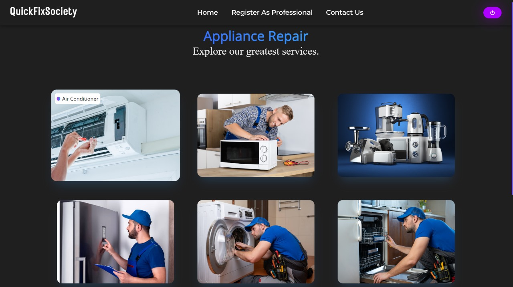
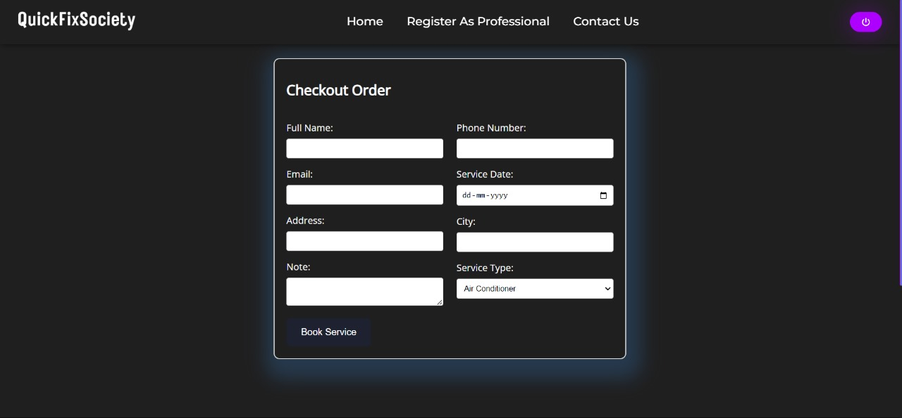

Sure! Here's an enhanced version of the README for QuickFixSociety with the addition of a webpage for service providers:

---

# *QuickFixSociety*

### First Year Internship Project

---

---

## 🌟 Introduction

Welcome to *QuickFixSociety*! This README file provides essential information about our project, designed to unite local service providers with residents. Our platform aims to simplify the process of finding reliable local services for everyday needs.

---

## 📝 Project Description

*QuickFixSociety* is a website dedicated to connecting residents with local service providers. Whether you need a plumber, electrician, cleaner, or any other service, QuickFixSociety brings them all together in one convenient place. Our goal is to create a reliable and efficient platform for residents to find and book trusted local services.

---

## 💻 Languages Used

- *HTML*
- *CSS*
- *JavaScript*

---

## 🔥 Project Features

- *🔎 Service Provider Directory:* A comprehensive directory of local service providers categorized by services offered.
- *⭐ User Reviews & Ratings:* Allow residents to leave reviews and ratings for the services they have used, ensuring trust and transparency.
- *📅 Booking System:* An easy-to-use booking system to schedule services directly through the website.
- *👤 Profile Management:* Service providers can create and manage their profiles, including service details, availability, and pricing.
- *🌐 Webpage for Service Providers:* A dedicated webpage for service providers to register and manage their services.

---

## 📸 Screenshots

### Service Provider Directory

Service Provider Directory

### Booking System

Booking System

### Webpage for Service Providers

Webpage for Service Providers

---

## 🙏 Thank You

Thank you for exploring *QuickFixSociety*. We hope our platform makes it easier for you to find and connect with reliable local service providers.

For any inquiries or support, please contact us at [support@quickfixsociety.com](mailto:support@quickfixsociety.com).

---

---

In this example:
- Replace ./assets/logo.png with the path to your logo image.
- Replace ./screenshots/service-directory.png, ./screenshots/booking-system.png, and ./screenshots/service-provider-page.png with the paths to your screenshots.
- Replace ./assets/footer.png with the path to your footer image.

Ensure that the paths are correct and relative to the location of your README file in the repository.
